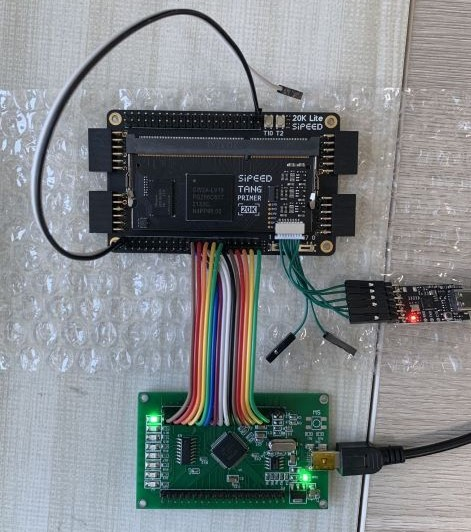

# 极简逻辑分析仪

基于 [SIPEED Tang Primer 20K](https://en.wiki.sipeed.com/hardware/zh/tang/tang-primer-20k/primer-20k.html)
和 FT2232H 开发的极简逻辑分析仪：

* 8 路采样
* 采样率可调（`COUNTER_SIZE`）

## 目录说明

* app：FT2232H 简单测试程序，使用 Visual Studio 编译；
* fpga：高云项目

## 准备工作

1. [下载](http://www.gowinsemi.com.cn/faq.aspx) 安装高云教育版 IDE；

1. 用[这个下载器](https://dl.sipeed.com/shareURL/TANG/programmer) 替换 IDE 里默认的下载器；

1. 下载安装 Visual Studio 2022 Community 用于编译桌面软件；

1. 准备一块 [FT2232H 开发版](https://m.tb.cn/h.UZyYVa9?tk=kiAu2uOPLSL)。

    * 使用 [FT_Prog](https://ftdichip.cn/Support/Utilities.htm#FT_PROG) 将端口 A 配置为 FIFO 模式

## 使用说明

直接用高云 IDE 编译、下载。

**注意事项：**

1. 下载时，务必断开 FT2232H 开发版以及其它使用了 FTDI 驱动的设备；
2. 务必保证 FPGA 的供电充足，否则可能出现下载失败等情况；
3. 如果还是出现下载失败，重新拔插下载器。

20K 与 FT2232H 的连接如下表。

| Primer 20K |   FT2232H Pin No.   |  说明    |
| --------   |  ---------------    | ------- |
|  K15       |   16                | ADBUS[0] |
|  K16       |   17                | ADBUS[1] |
|  H16       |   18                | ADBUS[2] |
|  G16       |   19                | ADBUS[3] |
|  P11       |   21                | ADBUS[4] |
|  R11       |   22                | ADBUS[5] |
|  L13       |   23                | ADBUS[6] |
|  K12       |   24                | ADBUS[7] |
|  H13       |   26                | RXF#     |
|  H12       |   27                | TXE#     |
|  T12       |   28                | RD#      |
|  K11       |   29                | WR#      |
|  K13       |   30                | SIWU     |
|  J12       |   32                | CLKOUT (60MHz)|
|  G11       |   33                | OE#      |

8 路探针如下表。

| Primer 20K |   探针 No.   |
| --------   |  -------    |
|  E15       |   0         |
|  F14       |   1         |
|  G14       |   2         |
|  J16       |   3         |
|  F13       |   4         |
|  M15       |   5         |
|  R13       |   6         |
|  R12       |   7         |

调试信号：N7 反映采样率。

## 下一步

1. 将本项目移植到 [SIPEED Tang Nano](https://en.wiki.sipeed.com/hardware/zh/tang/Tang-Nano-Doc/SUMMARY.html)
    系列，用以辅助 20K 上复杂项目的开发；

1. 与 [PulseView](https://sigrok.org/wiki/PulseView) 对接。
